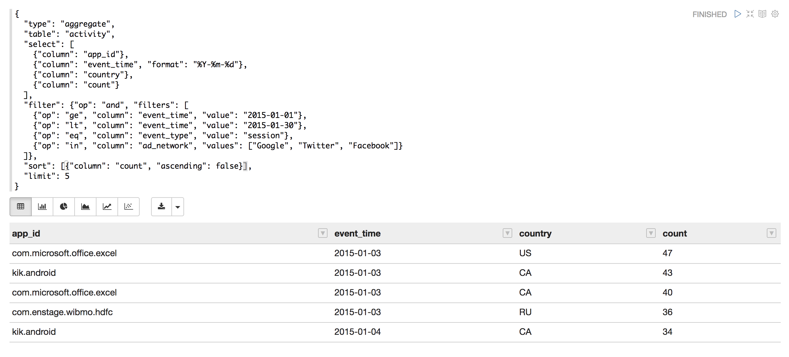
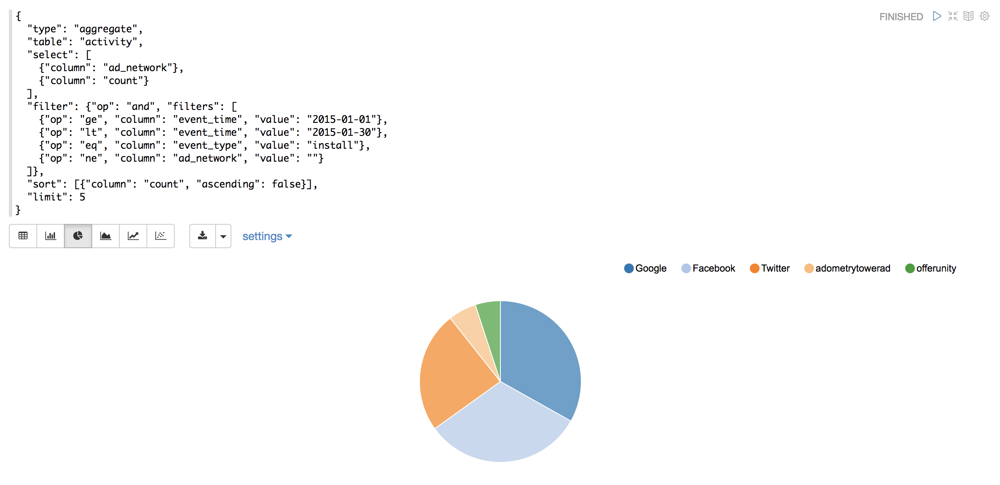

zeppelin-viyadb
================

Zeppelin interpreter for querying ViyaDB instance.

[](https://travis-ci.org/viyadb/zeppelin-interpreter)

## Screenshots





## Installation

Go to your Zeppelin package directory, and run:

```bash
./bin/install-interpreter.sh --name viyadb --artifact com.github.viyadb:zeppelin-viyadb:0.7.3
```

Then, follow the instructions contained in the output from the installation command.

## Usage

For query syntax please refer to the ViyaDB Website: http://viyadb.com
